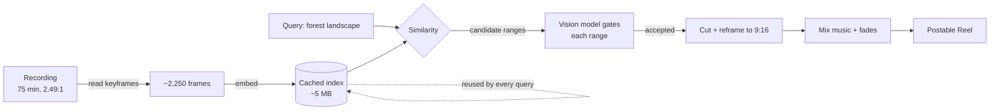
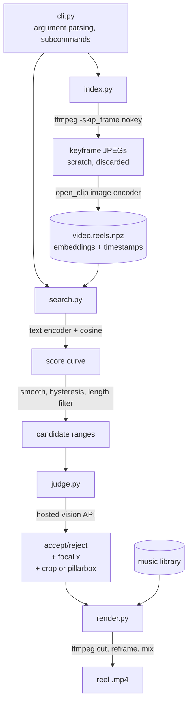

# Minecraft Reel Clipper - Plan

## Goal Capsule

- **Objective:** A creator with hours of raw Minecraft screen recordings can describe a moment in plain words and get back a finished, postable 9:16 Reel with music, without scrubbing a timeline.
- **Means:** Index each recording once from its existing keyframes, score those frames against the query, and have a hosted vision model gate the shortlist before ffmpeg cuts and reframes (KTD1, KTD3, KTD4).
- **Product authority:** This plan owns the query-to-Reel pipeline for an existing local footage library. Changes to how future sessions are recorded are a written guide (U6), not tool behavior.
- **Execution profile:** Greenfield Python package. No existing code to preserve, no migration, no rollout.
- **Stop conditions:** Stop and ask if CLIP scores cannot separate landscape frames from UI-overlay frames on real footage (U2 checkpoint) — that invalidates the shortlist design, not just a threshold.
- **Tail ownership:** The creator runs the tool locally. There is no deploy, no service, and no other consumer.

**Product Contract preservation:** unchanged. No R-ID was split, moved, reworded, or reclassified during planning.

---

## Product Contract

### Summary

A local command-line tool that turns a long Minecraft recording into postable Instagram Reels and YouTube Shorts from a text query. The creator asks for "forest landscape"; the tool returns finished 9:16 clips with music, cut at boundaries a vision model approved. Indexing a recording is a one-time cost; querying it afterward is cheap and repeatable, so a single session yields clips for several different themes.

### Problem Frame

The creator records 60–90 minute Minecraft sessions with shaders at 3410×1372, 60fps — roughly 7 GB per session, with about 15 GB already on disk. Getting a Reel out of one means opening a 75-minute clip in Kdenlive and scrubbing for the handful of moments worth posting. At a target of 2–3 Reels a week, that scrubbing is the bottleneck, and the volume of unreviewed footage grows faster than it gets cut.

Every existing open-source tool in this space (OpenShorts, AI-Youtube-Shorts-Generator, opensource-clipping, videoclipper) is built on the same pipeline: Whisper transcribes speech, an LLM picks quotable moments from the transcript, a face-tracker crops to the speaker. Minecraft landscape footage has no speech, no transcript, and no face. These tools do not degrade on it — they have no input at all.

The footage also fights the target format in two ways that only became visible after cutting real frames. At 2.49:1, a center crop to 9:16 keeps about 22% of the frame width, which on first-person footage usually means a close-up of whatever the player is standing next to rather than a landscape. And a large share of every session is unusable regardless of query: inventory screens, cave mining, night travel. Finding frames that match "forest" is the easy half; deciding which matches are *shots* and where each one starts and ends is the half nobody has built.

### Key Decisions

- **Vision-model judgment on a shortlist, not coded composition heuristics.** CLIP scores all frames cheaply; a vision model then gates the shortlist. *(session-settled: user-directed — chosen over hand-rolled depth/optical-flow heuristics, CLIP-only with manual review, and forking SentrySearch: buying judgment is less code than writing it, and the heuristics would need tuning against this specific footage.)* Governs R5, R6, R7.
- **Finished Reels, not timestamps or rough cuts.** The tool's output is something the creator can upload. *(session-settled: user-directed — chosen over emitting timestamps, unedited clips, or a Kdenlive project with markers: the manual finishing step is the bottleneck this exists to remove.)* Governs R8, R9, R10, R12.
- **Music is part of "postable."** *(session-settled: user-directed — chosen over leaving audio to Kdenlive: the creator already maintains a curated track library for exactly this footage.)* Governs R11, R12.
- **Salvage the existing library and change recording going forward.** *(session-settled: user-directed — chosen over fixing only one side: the 15 GB already recorded is worth clipping, and future sessions can be made easier to clip at no cost to this plan.)* Governs R14, R15, R16.
- **Index once, query many.** The embedding cache is the durable asset, so the expensive pass happens per recording rather than per query. Governs R2, R3, R4.
- **No vector database.** A 75-minute recording yields ~2,250 embeddings, which is single-digit megabytes — small enough that similarity is one in-memory operation. This is a framing decision about what infrastructure the tool is allowed to require, not a library choice.



### Requirements

**Indexing**

- R1. The tool accepts a local video file of arbitrary length as input; a 75-minute 7 GB recording is the working reference case.
- R2. Indexing a recording samples frames and stores one embedding per sampled frame, keyed to its timestamp in the source.
- R3. The index persists to disk alongside the recording and is reused on subsequent runs without re-sampling or re-embedding.
- R4. The tool detects that a recording is already indexed and skips straight to querying.

**Query and selection**

- R5. The creator supplies a free-text description of the desired content; the tool ranks sampled frames by semantic similarity to it and shortlists the top candidates.
- R6. Each shortlisted candidate is evaluated by a vision model for whether it is usable Reel material, judged on composition — a visible horizon or sense of depth rather than a near-field close-up — and on camera motion.
- R7. The evaluation rejects candidates showing a UI overlay (inventory, chest, crafting, pause, map) regardless of what the background scene contains.
- R8. For each accepted candidate the tool determines a start and end timestamp bounding a coherent moment, rather than emitting a fixed-length window around the matched frame.

**Reel output**

- R9. Output clips are encoded at 9:16 and at a resolution and frame rate accepted by both Instagram Reels and YouTube Shorts.
- R10. Reframing from the 2.49:1 source preserves the scene the query matched; a crop that discards the matched subject is a failed output, not an acceptable one.
- R11. Each output clip carries a music track selected from the creator's local library, trimmed to the clip's duration with a fade at the end.
- R12. An output clip is uploadable without further editing — correct aspect ratio, audio present and not clipping, no partial frames at either boundary.
- R13. When a query yields no candidate that passes R6 and R7, the tool reports that plainly rather than emitting its best failing match.

**Recording setup**

- R14. The plan records a recording-side configuration — HUD visibility, field of view, and capture aspect ratio — that makes future sessions easier to reframe than the existing library.
- R15. The tool works on recordings made under either the old or new configuration; the new configuration improves output quality but is not a precondition.
- R16. The recording-side change is documented as creator-applied setup, not enforced or detected by the tool.

### Key Flows

- F1. First clip from a new recording
  - **Trigger:** Creator finishes a session and wants a Reel from it.
  - **Steps:** Point the tool at the file; it reads and embeds the recording's keyframes once and writes the index. Creator supplies a query; the tool derives candidate ranges, has each gated, and cuts the survivors to 9:16 with music.
  - **Outcome:** A small set of postable clips, plus a persistent index.
  - **Covers R1, R2, R3, R5, R6, R7, R8, R9, R10, R11, R12.**

- F2. Second query against the same recording
  - **Trigger:** Creator wants a different theme from a recording already indexed.
  - **Steps:** The tool finds the existing index and skips extraction and embedding. Query, range derivation, gate, cut.
  - **Outcome:** More clips at a fraction of the first run's cost.
  - **Covers R3, R4, R5, R6, R7, R8, R9, R10, R11, R12.**

- F3. Query with nothing to return
  - **Trigger:** Creator asks for content the session does not contain, or contains only in unusable shots.
  - **Steps:** Range derivation produces candidates; every one is rejected for composition, motion, or UI overlay.
  - **Outcome:** The tool states that no usable clip was found and produces no file.
  - **Covers R6, R7, R13.**

### Acceptance Examples

- AE1. **Covers R7.** Given a session where the creator opened a large chest inside a forest biome, when the query is "forest landscape", then no clip is returned from the inventory-screen span even though the background behind the UI is forest.
- AE2. **Covers R6, R8.** Given a span where the creator walks up to a bamboo thicket and stands against it, when the query is "forest landscape", then the returned range covers the approach where the trees and horizon are visible and ends before the camera is pressed into the foliage.
- AE3. **Covers R10.** Given a matched shot where the subject of the query sits off-center in the 2.49:1 frame, when the clip is reframed to 9:16, then the subject remains in the output frame.
- AE4. **Covers R11.** Given a 28-second accepted clip and a music library whose tracks run 104–179 seconds, when the clip is produced, then its audio is a trimmed segment of one track ending in a fade, not a track cut off mid-phrase.
- AE5. **Covers R3, R4.** Given a recording indexed on a previous run, when the creator issues a new query against it, then no frame extraction or embedding occurs.
- AE6. **Covers R13.** Given a session recorded entirely underground, when the query is "forest landscape", then the tool reports no usable clip and writes no output file.

### Success Criteria

- A 75-minute session yields at least one clip the creator posts without opening Kdenlive.
- Sustaining 2–3 posted Reels per week does not require manual scrubbing of source footage.
- A second query against an already-indexed recording returns candidates fast enough that trying several phrasings is casual rather than a decision.
- The creator trusts the rejections: a "no usable clip" result is believed rather than treated as a prompt to go scrub manually.

### Scope Boundaries

**Deferred for later**

- Automatic upload or scheduling to Instagram or YouTube.
- Multi-clip compilation — stitching several accepted ranges into one Reel.
- Text overlays, titles, and captions.
- Batch operation across the whole footage library in one command.

**Outside this tool's identity**

- Transcription, speech-driven highlight detection, and subtitle generation. Absent from the source material and the reason existing tools do not apply.
- Face detection and speaker-tracked cropping.
- A web UI, hosted service, or multi-user product. This is a local single-creator tool.
- Virality scoring or engagement prediction. Selection is driven by the creator's query, not by a model's guess at what performs.

**Deferred to follow-up work**

- A local vision-model backend behind the same judge interface, for offline operation (KTD4 rejected it for now).
- GPU-accelerated decode. Keyframe extraction already runs at 54s for a 75-minute file on CPU (KTD1), so the win is not worth the CUDA build dependency yet.

### Dependencies / Assumptions

- The footage library lives in a local directory the creator controls (currently `~/Videos`), alongside a curated music library of 19 tracks running 104–179 seconds. Both stay local; no upload or sync is implied.
- Target clip length is 15–45 seconds. Unconfirmed by the creator; U2 exposes it as a flag so the default can move without a code change.
- The judge requires `GEMINI_API_KEY` in the environment. No unit provisions it; the creator creates the key once, and the tool reports a clear error when it is absent.
- The existing library carries a persistent red low-health vignette at the frame edges, present in every sample taken across the reference recording. The tool does not correct it. Clips from existing footage will ship tinted; U6 records it as a recording-side condition to resolve in-game.
- The creator continues finishing in Kdenlive when a clip needs work beyond what the tool produces.

---

## Planning Contract

### Key Technical Decisions

- KTD1. **Extract the recording's existing keyframes; never decode to a target frame rate.** Measured on `~/Videos/screenrecording-2026-09-12_00-34-20.mp4`: the recorder writes a keyframe every 2.0 seconds, so `-skip_frame nokey` yields 2,248 frames for the full 75 minutes in 54 seconds and 19 MB, against ~305 seconds to decode the same file at 1 fps. Two-second granularity is finer than any Reel boundary needs. Resolves the origin plan's deferred sampling question. Governs R2.
- KTD2. **The index is one `.npz` beside the source video; no database and no server.** ~2,250 × 512 float32 is about 5 MB, so similarity is a single matrix product in memory. Instantiates the Product Contract's "No vector database" decision. Governs R3, R4.
- KTD3. **CLIP owns the score curve and candidate ranges; the vision model owns accept/reject and crop focus.** Boundaries come from where the smoothed similarity curve stays elevated, which is real per-frame signal, rather than from a model reading timestamps off thumbnails. Narrows the vision model's role inside the Key Decision that governs R5, R6, R7.
- KTD4. **The judge calls Gemini's hosted vision API on its free tier.** *(session-settled: user-directed — chosen over a local Qwen2.5-VL-3B on the 6 GB RTX 3050 and over a pluggable dual backend: 6 GB caps local judgment quality, and a shortlist of ~20 frames per query is small enough that hosted cost is negligible.)* Gemini was chosen over Claude Haiku 4.5 and Sonnet 5 because its free vision quota covers this usage volume outright, making the tool free to run. Instantiates the Key Decision governing R6, R7. Requires network and a `GEMINI_API_KEY`; the offline backend is deferred.
- KTD5. **Reframing has two paths, chosen per clip by the judge.** Focal-point crop when the judge names an x-position that survives a 9:16 window; blurred pillarbox when it reports the shot needs full width. A single path cannot cover both a distant vista and a wide scene whose subject spans the frame. Governs R10.
- KTD6. **Range boundaries use percentiles of the query's own score distribution; emitting anything at all requires clearing an absolute floor.** CLIP similarity is not calibrated across prompts, so a fixed boundary cutoff that works for "forest landscape" fails for "cave with lava". But percentiles alone always admit the top few percent of frames, so a session with nothing matching would still shortlist candidates and spend judge calls. The absolute floor on the peak smoothed score is what makes an empty shortlist reachable. Governs R5, R8, R13.

### High-Level Technical Design

Module topology and data flow. Each arrow is data, not a call stack; `index` and `search` never run in the same invocation after the first.



Candidate-range derivation. Directional guidance for U2, not implementation specification:

```
scores  = cosine(frame_embeddings, encode_text(query))   # one per keyframe, 2.0s apart
smooth  = moving_average(scores, window=3)               # ~6s, kills single-frame spikes
if max(smooth) < ABSOLUTE_FLOOR: return []               # KTD6: nothing here matches at all
enter   = percentile(smooth, 97)                         # KTD6: boundaries are per-query
exit    = percentile(smooth, 90)
ranges  = hysteresis(smooth, enter, exit)                # open above enter, close below exit
ranges  = drop(ranges, shorter_than=MIN_SECONDS)
ranges  = [truncate_to_best_window(r, MAX_SECONDS) for r in ranges]
shortlist = top_n(ranges, by=peak_score, n=20)
```

Two mechanisms doing different jobs. The absolute floor answers "does this session contain the thing at all" — without it the percentiles admit the top 3% of frames on every query, so an entirely-underground session still shortlists twenty candidates for "forest landscape" and pays twenty judge calls to learn nothing. Hysteresis answers "where does this moment start and stop" — it keeps a moment whole, so a single dipped frame mid-shot does not split one range into two.

### Assumptions

- `open_clip` ViT-B/32 is sufficient to separate landscape frames from UI-overlay frames on this footage. U2 carries an explicit checkpoint that proves or disproves this before U3 is built on top of it.
- ffmpeg's keyframe interval is stable across the creator's recordings. All four existing files come from the same capture setup; U1 reads actual presentation timestamps rather than assuming a fixed 2.0s stride, so a different GOP degrades resolution instead of corrupting timing.
- A shortlist of ~20 candidate ranges is enough to yield at least one accepted clip on a typical session. Adjustable per U2's flag if it proves too tight.
- A single absolute cosine floor generalizes across queries well enough to separate "this session has none of that" from "this session has some". CLIP scores are not calibrated across prompts, so the floor is calibrated once during U2's verification checkpoint against a known-positive and a known-negative query on the reference recording, and exposed as a flag.
- Gemini's free vision tier covers 2–3 Reels per week at ~20 ranges per query. If the quota binds, the fallbacks are a smaller shortlist, fewer frames per range, or the deferred local backend.

### Output Structure

```
pyproject.toml
reels/
  __init__.py
  cli.py          # subcommands: index, clip
  index.py        # keyframe extraction + CLIP embedding + .npz cache
  search.py       # query scoring, smoothing, hysteresis, candidate ranges
  judge.py        # hosted vision API gate; accept/reject + focal x + reframe mode
  render.py       # ffmpeg cut, reframe, music bed, encode
tests/
  conftest.py
  fixtures/forest-90s.mp4
  test_index.py
  test_search.py
  test_judge.py
  test_render.py
  test_cli.py
docs/
  recording-setup.md
```

---

## Implementation Units

### U1. Package scaffold and keyframe index

- **Goal:** `reels index <video>` produces a persistent embedding cache from a recording's keyframes.
- **Requirements:** R1, R2, R3, R4. KTD1, KTD2.
- **Dependencies:** none.
- **Files:** `pyproject.toml`, `reels/__init__.py`, `reels/cli.py`, `reels/index.py`, `tests/conftest.py`, `tests/fixtures/forest-90s.mp4`, `tests/test_index.py`
- **Approach:**
  1. Set up a `uv`-managed package pinning `open_clip_torch`, `torch`, `numpy`, the Gemini client (KTD4), and `av` or a direct ffmpeg subprocess call. Expect the default torch wheel to pull ~3 GB of bundled CUDA.
  2. Read keyframe presentation timestamps with `ffprobe -skip_frame nokey -show_entries frame=pts_time`, rather than assuming a fixed 2.0s stride (see Assumptions).
  3. Extract the same keyframes with `ffmpeg -skip_frame nokey -i <src> -vf scale=224:224 -fps_mode passthrough` into a scratch directory. The image2 muxer carries no timestamps into the written files, so pair them against step 2's list by ordinal and fail if the counts disagree.
  4. Batch the frames through the CLIP image encoder on CUDA when available, CPU otherwise.
  5. Write embeddings and their timestamps to `<video>.reels.npz` next to the source, and discard the scratch JPEGs.
  6. On invocation, skip extraction and embedding when that file exists and is newer than the source.
  7. Generate `tests/fixtures/forest-90s.mp4` from the reference recording around the forest span near t=300s by re-encoding: downscale, CRF ~30, and force a 2.0s keyframe interval so the fixture preserves the GOP structure U1's and U2's tests depend on while staying small enough to commit. Tests derive the expected keyframe count from `ffprobe` against the fixture rather than hardcoding it.
- **Patterns to follow:** none — greenfield.
- **Test scenarios:**
  - Indexing the fixture writes an `.npz` whose embedding count matches the fixture's keyframe count as reported by `ffprobe -skip_frame nokey`.
  - Stored timestamps are monotonically increasing and the last one falls within the fixture's duration.
  - Covers AE5. Re-running index on an already-indexed fixture performs no extraction — assert via a spy on the ffmpeg invocation, not by timing.
  - A source file modified after its index was written triggers a re-index.
  - A missing input path exits with a clear error and no partial `.npz`.
  - A mismatch between the timestamp count and the extracted frame count fails loudly rather than pairing them off by truncation.
  - Embeddings are L2-normalized, so cosine similarity is a plain dot product downstream.
- **Verification:** `reels index` on the reference 75-minute file completes in under three minutes and writes an `.npz` under 10 MB.

### U2. Query scoring and candidate range derivation

- **Goal:** A text query over an existing index yields a ranked shortlist of candidate time ranges.
- **Requirements:** R5, R8. KTD3, KTD6.
- **Dependencies:** U1.
- **Files:** `reels/search.py`, `tests/test_search.py`
- **Approach:**
  1. Encode the query with the CLIP text encoder and take the dot product against the cached embedding matrix.
  2. Smooth the resulting curve over a 3-frame window. Return an empty shortlist immediately when the peak smoothed score falls below the absolute floor in KTD6.
  3. Derive ranges by hysteresis using the per-query percentile thresholds in KTD6.
  4. Drop ranges under the minimum length; for ranges over the maximum, keep the highest-scoring window of maximum length rather than discarding the range.
  5. Rank surviving ranges by peak score and return the top N.
  6. Expose minimum length, maximum length, N, and the absolute floor as flags. Clip-length defaults are in the Product Contract's Dependencies / Assumptions; the shortlist-size default is in the Planning Contract's Assumptions.
- **Execution note:** Before building U3 on top of this, run the checkpoint below against the reference recording and report the result. If CLIP cannot separate these classes, KTD3 and the whole shortlist design are wrong and the plan needs revisiting — this is the Goal Capsule stop condition.
- **Technical design:** See the Planning Contract's candidate-range pseudo-code. Directional guidance, not specification.
- **Test scenarios:**
  - A query matching the fixture's dominant content returns at least one range overlapping the known forest span.
  - Covers AE2. A range ends when the smoothed score falls below the exit threshold, not at a fixed offset from the peak frame.
  - Hysteresis keeps one range intact across a single dipped frame rather than splitting it in two.
  - A range shorter than the minimum length is dropped.
  - A range longer than the maximum is truncated to its highest-scoring window, and the returned length equals the maximum.
  - Two queries with different absolute score distributions both produce ranges, confirming boundary thresholds are per-query (KTD6).
  - A query whose peak smoothed score falls below the absolute floor returns an empty shortlist, even though the top 3% of its frames clear the 97th percentile by construction.
  - A query matching nothing in the index returns an empty shortlist rather than raising.
- **Verification checkpoint:** On the reference recording, frames from the known chest-inventory span near t=2700s score below the entry threshold for "forest landscape" while frames from the known forest span near t=300s score above it. The same run calibrates the absolute floor: pick a value that "forest landscape" clears on this recording and that a query for content the recording does not contain does not.

### U3. Vision-model shot judge

- **Goal:** Each candidate range is accepted or rejected, and accepted ranges carry the information needed to reframe them.
- **Requirements:** R6, R7. KTD4, KTD5.
- **Dependencies:** U2.
- **Files:** `reels/judge.py`, `tests/test_judge.py`
- **Approach:**
  1. For each candidate range, pull a small set of representative frames at full resolution.
  2. Send them to Gemini (KTD4) in one request per range, asking for a verdict, a reason, a focal x-position as a fraction of frame width, and whether the shot survives a 9:16 crop or needs pillarboxing. Use the provider's structured-output mechanism rather than parsing free text.
  3. Reject on UI overlay, near-field composition, or erratic camera motion.
  4. Return a structured verdict per range; never return prose the caller has to parse.
  5. Fail with a clear, actionable message when `GEMINI_API_KEY` is absent or the request errors — do not silently accept.
- **Test scenarios:**
  - Covers AE1. A range whose frames show an inventory or chest screen is rejected, and the recorded reason names the overlay.
  - Covers AE3. An accepted range returns a focal x within 0 and 1.
  - An accepted range returns exactly one of the two reframe modes.
  - A range whose frames show a near-field close-up is rejected on composition.
  - A missing `GEMINI_API_KEY` exits with a message naming the environment variable, and no clip is produced.
  - An API error or timeout surfaces to the caller rather than being swallowed into a rejection.
  - A malformed or incomplete response is treated as an error, not as a rejection.
- **Verification:** Run against the reference recording's known forest and known chest-inventory spans; the forest span is accepted and the inventory span is rejected.

### U4. Reframe, music, and encode

- **Goal:** An accepted range becomes a finished 9:16 file with a music bed.
- **Requirements:** R9, R10, R11, R12. KTD5.
- **Dependencies:** U3.
- **Files:** `reels/render.py`, `tests/test_render.py`
- **Approach:**
  1. Cut the range from the source with re-encoding, since reframing rules out a stream copy.
  2. Apply the reframe mode from U3's verdict: a 9:16 crop window centered on the focal x and clamped to the frame edges, or a scaled full-width overlay on a blurred, zoomed copy of itself.
  3. Scale to 1080×1920 and encode at a frame rate both target platforms accept.
  4. Pick a track from the music directory, trim it to the clip's duration, and apply a fade at the end. The directory defaults to `~/Videos`, which also holds the source recordings, so select by audio extension (`.mp3`, `.m4a`, `.flac`, `.wav`, `.ogg`) and exclude video containers.
  5. Replace the source audio with the music bed and normalize so the output does not clip.
  6. Name outputs from the source file, query, and start timestamp so repeated runs do not collide.
- **Test scenarios:**
  - Covers AE3. Crop mode with a focal x near a frame edge produces a window clamped inside the frame, with output dimensions still exactly 9:16.
  - Pillarbox mode produces an output whose full source width is visible within the frame.
  - Covers AE4. A 28-second clip yields 28 seconds of audio ending in a fade, taken from a track longer than the clip.
  - A clip longer than the shortest available track still produces continuous audio.
  - Output peak amplitude stays below clipping.
  - Covers AE2. Output duration matches the requested range within one frame at both boundaries.
  - Rendering the same range twice does not overwrite the first output.
  - A music directory holding both recordings and tracks selects only audio, never a multi-gigabyte `.mp4`.
  - A directory whose only audio file is `.m4a` still yields a track, so the filter is not `.mp3`-only.
  - An empty or missing music directory produces a clear error rather than a silent clip.
- **Verification:** A rendered clip plays correctly in a standard player at 1080×1920, and `ffprobe` reports both a video and an audio stream.

### U5. CLI wiring and empty-result path

- **Goal:** `reels clip <video> "<query>"` runs the whole pipeline end to end.
- **Requirements:** R13. F1, F2, F3.
- **Dependencies:** U1, U2, U3, U4.
- **Files:** `reels/cli.py`, `tests/test_cli.py`
- **Approach:**
  1. Wire `clip` to index on demand when no cache exists, then search, judge, and render.
  2. Report progress per stage, since indexing a 75-minute file takes minutes on first run.
  3. When every candidate is rejected, print what was tried and how many candidates were rejected for which reason, and exit without writing a file.
  4. Surface the deferred-question flags from U2 and the music directory from U4 as command-line options.
- **Test scenarios:**
  - Covers F1. `clip` on an unindexed fixture indexes it first, then produces a clip.
  - Covers F2, AE5. `clip` on an indexed fixture skips indexing.
  - Covers F3, AE6. When the judge rejects every candidate, the exit is clean, the reasons are printed, and no file is written.
  - A query returning an empty shortlist from U2 reports no candidates rather than calling the judge.
  - An unreadable or non-video input exits with a clear error.
- **Verification:** On the reference 75-minute recording, `reels clip <file> "forest landscape"` produces at least one playable 9:16 file with music.

### U6. Recording setup guide

- **Goal:** The creator has a written setup that makes future recordings easier to reframe than the existing library.
- **Requirements:** R14, R15, R16.
- **Dependencies:** none. Can land at any point.
- **Files:** `docs/recording-setup.md`
- **Approach:**
  1. Record the HUD, field-of-view, and capture-aspect settings to change, and what each one fixes.
  2. Note the low-health vignette observed across the entire reference recording as a capture-time condition, since the tool does not correct it.
  3. State that the tool works on recordings made either way (R15) and that nothing here is enforced in code (R16).
- **Test expectation:** none — documentation, no behavior.
- **Verification:** A reader can apply every setting without opening the source.

---

## Verification Contract

- `uv run pytest` passes. Every unit above contributes tests to the paths named in its `**Files:**`.
- `uv run ruff check .` passes.
- Unit tests run against `tests/fixtures/forest-90s.mp4` and complete without network access, with the judge stubbed.
- One end-to-end check is manual and runs against real footage, because no fixture can prove the claims the design rests on: `reels clip ~/Videos/screenrecording-2026-09-12_00-34-20.mp4 "forest landscape"` produces at least one playable clip.
- U2's verification checkpoint is a gate, not a test: report its result before U3 is built.

## Definition of Done

**Global**

- All six units are complete and their verification statements hold.
- The end-to-end check produced a clip the creator judges postable.
- No dead-end or experimental code from abandoned approaches remains in the tree.
- `docs/recording-setup.md` exists and is applicable without further explanation.

**Per unit**

- U1 — `reels index` writes a reusable cache and re-running it performs no work.
- U2 — the verification checkpoint separates the known forest and known inventory spans, the absolute floor is calibrated and recorded, and the result is reported.
- U3 — the judge accepts the known forest span and rejects the known inventory span.
- U4 — a rendered clip is 1080×1920 with a faded music bed and no clipping.
- U5 — a query with no usable result exits cleanly, explains why, and writes nothing.
- U6 — the guide covers HUD, field of view, capture aspect, and the vignette.

---

## Sources / Research

Reference recording: `~/Videos/screenrecording-2026-09-12_00-34-20.mp4` — 4496s, 3410×1372, 60fps, h264, 6.9 GB. Three further recordings and a `minecraft1.kdenlive` project sit alongside it, totaling ~15 GB.

Measurements taken on that file during planning, which KTD1 and KTD2 rest on:

| Measurement | Result |
|---|---|
| Keyframe interval | 2.0s, uniform across the sampled span |
| Keyframe-only extraction, full file | 2,248 frames, 54s wall, 19 MB at 224×224 |
| Full decode at 1 fps, extrapolated | ~305s wall, 4,500 frames |
| Music library | 19 tracks, 104–179s |

Machine: RTX 3050 6 GB, i5-14400F (16 threads), 31 GB RAM, ffmpeg n9.0.1 with CUDA available, Python 3.14.7 with `uv`. The 6 GB VRAM ceiling is the constraint KTD4 turns on.

Crop comparison rendered from the reference recording at t=300s and saved to `crop-probe.png` at the project root — center crop with HUD, blurred pillarbox, and tight top-weighted crop. It is the evidence for R10 and KTD5, and for the Problem Frame's claim that no single crop path rescues both shot types.

Prior art surveyed, all speech-driven and therefore inapplicable:

- [OpenShorts](https://github.com/mutonby/openshorts) — Whisper + LLM moment detection, face tracking, subtitles.
- [AI-Youtube-Shorts-Generator](https://github.com/Anil-matcha/AI-Youtube-Shorts-Generator) — transcript-based highlight detection, vertical auto-crop.
- [opensource-clipping](https://github.com/NaufalRizqullah/opensource-clipping) — active-speaker detection and scene-aware switching.
- [videoclipper](https://github.com/imgly/videoclipper) — Gemini selects clips as transcript text, matched back to frame-accurate ranges.

Closest prior art, and the only visually-driven examples found:

- [SentrySearch](https://github.com/ssrajadh/sentrysearch) — chunks video, embeds with Gemini or a local vision-language model, and trims the top text-query match into a clip. Built as a search tool, so it has no shot-quality judgment, no boundary refinement, and no vertical output.
- [video-rag-bot](https://github.com/di37/video-rag-bot) and [clip-finder](https://github.com/GhostPeony/clip-finder) — frame-level semantic search returning timestamps, not ranges.
